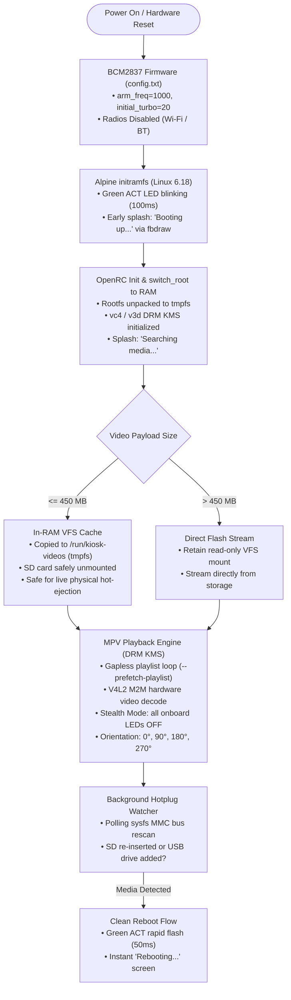

# Raspberry Pi 3 Video Kiosk

[](https://github.com/Segilmez06/rpi3-videokiosk/releases)
[](https://www.raspberrypi.com/products/raspberry-pi-3-model-b/)
[](https://en.wikipedia.org/wiki/AArch64)
[](https://alpinelinux.org/)
[](https://dri.freedesktop.org/)
[](https://www.gnu.org/licenses/gpl-3.0)

A commercial-grade, plug-and-play digital signage appliance for the **Raspberry Pi 3 Model B (`aarch64`)**. Engineered for exhibitions, retail installations, museums, and continuous display environments where power cuts are frequent, physical tampering must be prevented, and setup friction must be zero.

The system runs **100% in-RAM (`tmpfs`)** using a diskless Alpine Linux architecture. The SD card is unmounted during playback—enabling safe live physical hot-ejection—and filesystem corruption on abrupt power cuts is mathematically impossible.

---

## System Architecture



---

## Why This Architecture?

| Criterion | Standard Raspberry Pi OS / DietPi | Video Kiosk (Alpine Run-from-RAM) |
| :--- | :--- | :--- |
| **Filesystem Safety** | Ext4 journal easily corrupts on sudden power cuts | **100% immune**; root filesystem exists only in volatile RAM |
| **SD Card Life** | Continuous disk writes degrade flash memory cells | **Zero write wear**; storage is mounted read-only, then unmounted |
| **Cold Boot Time** | ~35 – 55 seconds (systemd, udev, network, dbus) | **~6 – 8 seconds** (direct BusyBox + OpenRC into DRM KMS) |
| **Display Pipeline** | Overhead of X11/Wayland window server (~120MB RAM) | **Direct DRM KMS CRTC modesetting** via VideoCore IV Gallium |
| **Media Management** | SSH, Samba, or ext4 partitions hidden on Windows | **Single FAT32 partition** visible on Windows, macOS, and Linux |
| **Physical Hot-Swap** | Removing SD during playback causes kernel panic | **SD can be physically removed** while videos loop from RAM |
| **Console on HDMI** | Kernel logs, login prompt, blinking cursor on screen | **Completely silent HDMI**; console isolated to GPIO 14/15 UART |

---

## Quick Start

### 1. Flashing the SD Card

Download the latest release artifact from the [Releases](https://github.com/Segilmez06/rpi3-videokiosk/releases) page:

#### Option A: Flash with `dd` (Recommended for fresh cards)
```bash
xzcat alpine-kiosk.img.xz | sudo dd of=/dev/sdX bs=4M status=progress conv=fsync
```
*(Replace `/dev/sdX` with your target SD card device).*

#### Option B: Direct FAT32 Extract (No disk formatting required)
If you have an existing SD card formatted as FAT32, simply extract the tarball onto the card root:
```bash
sudo tar -xzf alpine-kiosk-sdcard.tar.gz -C /media/your-sdcard/
```

### 2. Adding Videos

1. Insert the flashed SD card into your PC (Windows, macOS, or Linux).
2. Open the **`videos/`** directory.
3. Drop your video files into the folder. Files will play in alphabetical order.
4. Safely eject the card, insert it into the Raspberry Pi 3, and connect power.

> **Supported Formats:** `.mp4`, `.mkv`, `.avi`, `.mov`, `.webm`, `.ts` (H.264 / MPEG-4 AVC recommended).  
> **Filenames with Spaces:** Fully supported (e.g. `01 Welcome Video.mp4`).  
> **USB Drives:** You can also drop videos into a `videos/` folder on any standard USB thumb drive and plug it in.

### 3. Screen Rotation (`orientation.txt`)

To rotate the display for portrait totems or inverted ceiling mounts, edit `orientation.txt` on the SD card root:

| Value | Orientation | Notes |
| :--- | :--- | :--- |
| `0` | **Landscape (Standard)** | Default (0° rotation) |
| `90` | **Portrait (Clockwise)** | Vertical screens, totems (90° right) |
| `180` | **Inverted Landscape** | Ceiling or flipped mounts (180°) |
| `270` | **Inverted Portrait** | Vertical screens (90° left) |

Orientation can also be changed at runtime via serial console:
```bash
kiosk-orientation 90
```

---

## Technical Documentation (`docs/`)

Deep architectural breakdowns, hardware schematics, and subsystem implementations are documented in dedicated guides:

- [**System Architecture & Diskless Design**](docs/architecture.md) — Pure RAM execution, Alpine `apkovl` overlay system, and the end-to-end boot sequence.
- [**Display Pipeline & `fbdraw` Renderer**](docs/display-and-graphics.md) — Zero-libc freestanding AArch64 C renderer, 4-state visual lifecycle, DRM KMS handoff, and typography.
- [**Hardware, Power & UART Backend**](docs/hardware-and-power.md) — BCM2837 clock caps, brownout prevention, PL011 UART wiring, and serial autologin.
- [**Hardware LED State Machine**](docs/led-state-machine.md) — LED operational state matrix, venue stealth mode, and Linux kernel `ledtrig-timer` sysfs quirks.
- [**Media Caching & Playlist Engine**](docs/media-and-storage.md) — In-RAM tmpfs VFS, memory budget, safe live hot-ejection, and playlist prefetching.
- [**Hotplug Watcher & MMC Bus Polling**](docs/hotplug-and-reboot.md) — Detecting SD insertion without a Card Detect pin and automated clean reboot flow.
- [**Build System & Offline Tooling**](docs/build-system.md) — Reproducible offline rootless image generation with `apk.static` and `mtools`.

---

## Building from Source

The entire appliance is built rootlessly on any modern Linux host (Arch Linux, CachyOS, Debian, Ubuntu):

### Host Dependencies
```bash
# Arch Linux / CachyOS:
sudo pacman -S mtools dosfstools tar curl xz clang lld llvm python python-pillow

# Debian / Ubuntu:
sudo apt-get install curl tar gzip xz-utils parted dosfstools mtools clang lld llvm python3 python3-pil
```

### Build Command
```bash
./alpine-kiosk/build.sh
```

The build script will:
1. Fetch and verify official Alpine Linux 3.24.2 tarballs and developer signing keys.
2. Compile the freestanding `fbdraw` binary (`clang -target aarch64-linux-gnu -nostdlib -static`).
3. Patch `initramfs-rpi` with early splash blitting, DRM pruning, and LED triggers.
4. Download and cache required APK packages (`mpv`, `mesa-dri-gallium`, `eudev`, `alsa-utils`).
5. Build the appliance overlay archive (`rpi3-kiosk.apkovl.tar.gz`).
6. Generate both `output/alpine-kiosk.img.xz` and `output/alpine-kiosk-sdcard.tar.gz`.

---

## Credits & License

- **Author:** Sarp Eren EGILMEZ ([@Segilmez06](https://github.com/Segilmez06))
- **Typography:** [Inter font family](https://rsms.me/inter/) by Rasmus Andersson (SIL Open Font License).
- **License:** GNU General Public License v3.0 (GPLv3). See [LICENSE](LICENSE) for details.
