# Architecture: Pure Run-from-RAM Diskless Kiosk

The Raspberry Pi 3 Video Kiosk runs **Alpine Linux 3.24.2** in a pure diskless, run-from-RAM (`tmpfs`) architecture. The root filesystem (`/`) is mounted in volatile system memory, while storage volumes are mounted strictly read-only or unmounted during active playback.

---

## 1. Architectural Philosophy: Why Alpine Linux?

Traditional single-board computer distributions like Debian, Raspberry Pi OS, or DietPi rely on standard block-device installations where `/` resides on an Ext4 partition on the SD card. While suitable for general-purpose computing, that design introduces systemic failure points in commercial kiosk deployments:

| Engineering Parameter | Standard OS (Debian / Raspberry Pi OS) | Alpine Linux Diskless Kiosk |
| :--- | :--- | :--- |
| **Root Filesystem** | Persistent Ext4 block device (`/dev/mmcblk0p2`) | Pure `tmpfs` RAM filesystem (`size=100%`) |
| **Storage Mount State** | Read-write root with journaling (`jbd2`) | Read-only during boot, unmounted during playback |
| **Write Wear on SD Card** | High (syslog, journald, logrotate, atime, swap) | **Zero write cycles** during runtime |
| **Power-Cut Corruption** | Frequent dirty unmounts, journal corruption, `fsck` lock | **Mathematically impossible**; no persistent writes exist |
| **Cold Boot Latency** | 35–55 seconds (systemd units, D-Bus, network) | **6–8 seconds** (direct BusyBox + OpenRC into DRM KMS) |
| **Base Memory Footprint**| ~120–250 MB idle RAM consumed by OS | **~38 MB idle RAM** consumed by Alpine base |
| **Configuration Delta** | Scattered across `/etc`, `/var`, and `/usr` | Cleanly isolated in [`rpi3-kiosk.apkovl.tar.gz`](file:///home/sarp/rpi3-videokiosk/alpine-kiosk/build/staging/rpi3-kiosk.apkovl.tar.gz) |

### Key Architectural Decisions

1. **Native `apkovl` Overlay System:**
   Alpine's diskless mode uses an Alpine Local Backup Overlay archive (`.apkovl.tar.gz`). During boot, the init script unpacks this tarball directly onto the freshly created `tmpfs` rootfs. Appliance modifications (OpenRC scripts in `/etc/init.d`, configurations in `/etc/mpv`, and utilities in `/usr/bin`) exist as a single compressed archive on the FAT32 boot partition.
2. **Minimal Footprint for Maximum Video Cache:**
   The Raspberry Pi 3 Model B provides 1 GB of LPDDR2 SDRAM shared between the ARM CPU and the VideoCore IV GPU (`gpu_mem=128`). By stripping systemd, PAM, D-Bus, NetworkManager, and graphical display servers (X11/Wayland), the OS kernel and userland consume under 50 MB of RAM. This leaves up to **450 MB of RAM exclusively for in-memory video caching** while preserving ~400 MB of headroom for MPV decoding buffers and kernel slab allocators.
3. **Deterministic State on Every Boot:**
   Because all system state resides in volatile memory, every reboot initiates from the exact same bit-for-bit pristine configuration. Ephemeral log files in `/var/log` and runtime sockets in `/run` vanish on reboot, eliminating memory leaks, disk filling, or configuration drift over years of unattended continuous operation.

---

## 2. Power-Cut Immunity: The Mathematics of tmpfs

Standard flash memory corruption during sudden power loss occurs due to unfinished NAND flash block erase/write cycles and corrupted filesystem metadata structures (superblocks, inode tables, Ext4 journals). 

In this appliance:
$$\text{Storage State during Playback} = \emptyset \quad (\text{SD card unmounted})$$

When the kiosk finishes caching media into [`/run/kiosk-videos`](file:///home/sarp/rpi3-videokiosk/alpine-kiosk/overlay/usr/bin/kiosk-player.sh#L12), it invokes:
```sh
sync
umount /media/mmcblk0p1 2>/dev/null || true
```
At this point, the Linux VFS has zero open file descriptors pointing to `/dev/mmcblk0*`. The MMC host controller enters an idle state. An abrupt power cut drops the $V_{\text{DD}}$ rail to 0V without any active write operations, guaranteeing that the FAT32 boot partition remains completely untouched and pristine.

Even when streaming large media files (> 450 MB) directly from disk, `/media/mmcblk0p1` is mounted with the read-only flag (`ro,noatime,nodev,noexec`). Because the FAT32 driver issues exclusively read commands (`CMD17`/`CMD18` over the MMC bus), flash wear and corruption cannot occur.

---

## 3. End-to-End Boot Flow

The kiosk follows a streamlined execution path from hardware power-on to video playback on DRM KMS:

```mermaid
flowchart TD
    S1["<b>1. BCM2837 Firmware Bootloader (GPU Stage)</b><br/>• Reads bootcode.bin & start.elf from FAT32 partition<br/>• Loads config.txt: arm_freq=1000, initial_turbo=20, dtoverlay=vc4-kms<br/>• Initializes simplefb on HDMI at 1920x1080@60Hz"]
    --> S2["<b>2. Linux Kernel (AArch64) Initialization</b><br/>• Decompresses boot/vmlinuz-rpi with cmdline.txt<br/>• Hardware UART console active on ttyAMA0,115200 (GPIO 14/15)<br/>• HDMI console silenced (logo.nologo, vt.global_cursor_default=0)"]
    --> S3["<b>3. Alpine initramfs (/init execution)</b><br/>• Mounts /sys & sets Green ACT LED blinking (100ms timer)<br/>• Freestanding fbdraw blits 'Booting up...' to /dev/fb0 in &lt; 15ms<br/>• Mounts FAT32 boot partition and unpacks apkovl into tmpfs<br/>• Transfers execution to RAM via switch_root"]
    --> S4["<b>4. Userspace Init (OpenRC & Inittab)</b><br/>• /etc/inittab starts OpenRC sysinit, boot, & default runlevels<br/>• Spawns autologin root shell on ttyAMA0 (xterm-256color)<br/>• Intentionally omits tty1-tty6 to keep HDMI clean<br/>• Launches OpenRC daemon: /etc/init.d/kiosk-player"]
    --> S5["<b>5. Kiosk Playback Engine (/usr/bin/kiosk-player.sh)</b><br/>• Loads vc4 & v3d DRM KMS modules; displays 'Searching media...'<br/>• Reads orientation from orientation.txt (0°, 90°, 180°, 270°)<br/>• Evaluates payload: &le; 450 MB caches to tmpfs & unmounts SD card<br/>• Starts background sysfs MMC replug watcher<br/>• Enters STEALTH MODE (all LEDs off) & starts gapless MPV loop"]
```



---

## 4. Subsystem Responsibilities

### Linux Kernel & Device Tree
The kernel image [`boot/vmlinuz-rpi`](file:///home/sarp/rpi3-videokiosk/alpine-kiosk/configs/config.txt#L5) is the official 64-bit Raspberry Pi kernel provided by Alpine Linux. Device tree overlays configured in [`alpine-kiosk/configs/config.txt`](file:///home/sarp/rpi3-videokiosk/alpine-kiosk/configs/config.txt) disable unused hardware (Wi-Fi, Bluetooth, onboard audio) and configure the VideoCore IV display controller (`vc4-kms-v3d`).

### Early initramfs Layer
The initramfs is customized during the offline build via [`alpine-kiosk/scripts/patch_initramfs.py`](file:///home/sarp/rpi3-videokiosk/alpine-kiosk/scripts/patch_initramfs.py). It embeds a standalone C binary [`fbdraw`](file:///home/sarp/rpi3-videokiosk/alpine-kiosk/scripts/fbdraw.c) that maps the firmware framebuffer [`/dev/fb0`](file:///home/sarp/rpi3-videokiosk/alpine-kiosk/scripts/fbdraw.c#L180) and renders the `"Booting up..."` splash image before any userspace daemon loads.

### OpenRC & Kiosk Player Service
OpenRC handles service supervision. The player script [`/usr/bin/kiosk-player.sh`](file:///home/sarp/rpi3-videokiosk/alpine-kiosk/overlay/usr/bin/kiosk-player.sh) is defined as a background service via [`/etc/init.d/kiosk-player`](file:///home/sarp/rpi3-videokiosk/alpine-kiosk/overlay/etc/init.d/kiosk-player). It handles orientation detection, dynamic LED transitions, RAM caching, and MPV supervision in a fault-tolerant loop.
