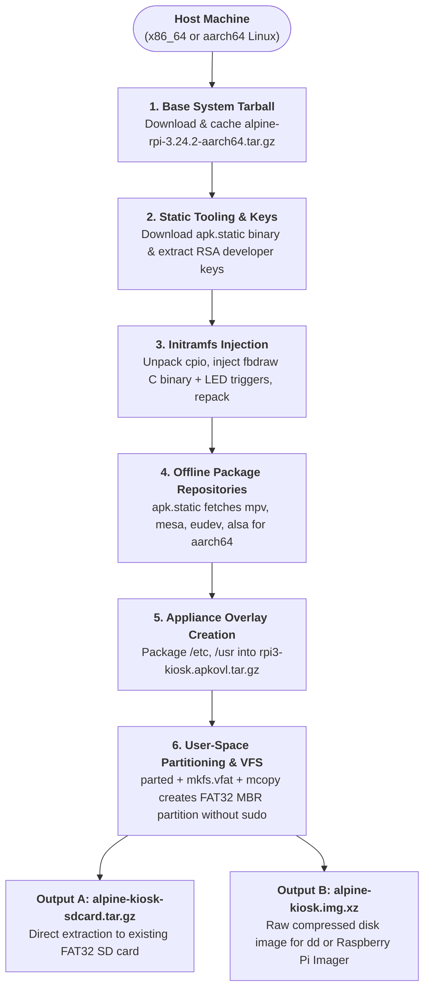

# Build System & Offline Rootless Image Generation

A core design goal of the Raspberry Pi 3 Video Kiosk appliance is **100% reproducible, rootless offline image generation**.

Most embedded Linux image builders (such as `pi-gen`, Yocto, or Buildroot) require root permissions (`sudo`), QEMU emulation for foreign architectures, kernel loopback devices (`/dev/loopX`), and complex chroot environments. In contrast, this project's build pipeline compiles, resolves dependencies, constructs filesystems, and outputs bootable images **entirely in user space** without root privileges.

---

## 1. Pipeline Overview



---

## 2. Key Architectural Components

### 2.1 Rootless Foreign-Architecture Package Fetching (`apk.static`)
Instead of running an `aarch64` Alpine container through QEMU `binfmt_misc`, the build system downloads the official `apk-tools-static` binary for the host (`x86_64`) and uses it in fetch mode:

```bash
apk.static fetch \
    --keys-dir cache/keys \
    --arch aarch64 \
    -X https://dl-cdn.alpinelinux.org/alpine/v3.24/main \
    -X https://dl-cdn.alpinelinux.org/alpine/v3.24/community \
    -o cache/packages \
    -R alpine-base eudev mesa-dri-gallium mpv
```

- **Architecture Spoofing (`--arch aarch64`):** Directs the static package manager to resolve dependency graphs specifically for ARM64 targets.
- **Cryptographic Verification (`--keys-dir`):** All downloaded APKs are verified against official Alpine Linux RSA developer public keys extracted directly from the base release tarball.
- **Multi-Repository Index Partitioning:** The build script separates downloaded `.apk` archives into `/apks/main/aarch64` and `/apks/community/aarch64`, embedding the signed `APKINDEX.tar.gz` and `.boot_repository` markers. This enables Alpine's diskless boot loader to install packages into RAM without requiring an internet connection at runtime.

---

### 2.2 Rootless FAT32 Partitioning (`mtools` & `parted`)
Creating a raw partition table and filesystem usually requires `losetup` and `mount`, which demand root permissions and can leave hanging loopback devices if interrupted.

The kiosk build system avoids this entirely using `mtools` byte-offset targeting:
1. **Allocate Image:** A sparse raw disk image is created with `truncate -s <size>M alpine-kiosk.img`.
2. **Partitioning:** `parted` writes an MBR table with a single primary FAT32 partition starting at sector 2048 (1 MiB offset) and flags it as bootable:
   ```bash
   parted -s alpine-kiosk.img mklabel msdos mkpart primary fat32 2048s 100% set 1 boot on
   ```
3. **In-File Formatting:** `mkfs.vfat` formats the partition directly inside the file using `--offset 2048`:
   ```bash
   mkfs.vfat -F 32 -n "VIDEOKIOSK" --offset 2048 alpine-kiosk.img
   ```
4. **Populate Filesystem (`mcopy`):** GNU `mcopy` accesses the FAT32 volume using the byte offset syntax (`@@1048576` = $2048 \times 512$ bytes):
   ```bash
   mcopy -s -i "alpine-kiosk.img@@1048576" staging/* ::
   ```
   Zero root privileges or kernel mounts are ever required.

---

### 2.3 Initramfs CPIO Injection (`patch_initramfs.py`)
To achieve early boot splash graphics within 2 seconds of power-on, the standard Alpine `initramfs-rpi` is modified during the build:
1. The gzipped CPIO archive `boot/initramfs-rpi` is decompressed and unpacked.
2. The compiled freestanding `fbdraw` AArch64 C binary and `booting.ppm` image are injected into `/bin/` and `/usr/share/`.
3. The early `init` script is patched with:
   - Green ACT LED 100ms blink trigger.
   - Immediate execution of `/bin/fbdraw /usr/share/booting.ppm`.
   - Stripping of unnecessary graphics modules from the initramfs stage (letting DRM KMS initialize cleanly later in userspace).
4. The archive is repacked with gzip compression and written back to `staging/boot/initramfs-rpi`.

---

### 2.4 Appliance Overlay Packaging (`apkovl`)
Alpine Linux diskless systems use the `.apkovl.tar.gz` mechanism to persist configuration and custom scripts into volatile RAM:
- The build script packages [`alpine-kiosk/overlay`](file:///home/sarp/rpi3-videokiosk/alpine-kiosk/overlay) into `rpi3-kiosk.apkovl.tar.gz`.
- Files are assigned `root:root` ownership (`--owner=0 --group=0 --numeric-owner`) without needing `chown` on the host.
- The overlay contains:
  - `/etc/init.d/kiosk-player` (OpenRC daemon managing DRM KMS and MPV).
  - `/etc/udev/rules.d/99-kiosk-replug.rules` (Media hotplug events).
  - `/etc/inittab` and `/etc/shadow` (Configured for quiet boot and authenticated PL011 UART login).
  - `/usr/bin/led` and `/usr/bin/kiosk-orientation` management tools.

---

## 3. Host System Requirements

The build system requires standard POSIX utilities, Clang/LLVM for freestanding AArch64 C compilation, and Python with Pillow for PPM rasterization.

### Arch Linux / CachyOS
```bash
sudo pacman -S --needed \
    curl tar gzip xz parted dosfstools mtools \
    clang lld llvm \
    python python-pillow
```

### Debian / Ubuntu (22.04+ / 24.04+)
```bash
sudo apt-get update && sudo apt-get install -y \
    curl tar gzip xz-utils parted dosfstools mtools \
    clang lld llvm gcc-aarch64-linux-gnu \
    python3 python3-pil
```

### Fedora (39+ / 40+)
```bash
sudo dnf install -y \
    curl tar gzip xz parted dosfstools mtools \
    clang lld llvm \
    python3 python3-pillow
```

---

## 4. Running the Build

Execute the build script from the repository root:
```bash
./alpine-kiosk/build.sh
```

### Build Artifacts (`output/`)
Upon completion, two production-ready artifacts are generated:

| Artifact | File Size | Description | Recommended Use Case |
| :--- | :--- | :--- | :--- |
| **`alpine-kiosk.img.xz`** | ~140 MB | Compressed full raw disk image with MBR & FAT32 partition | Raw flashing to blank SD cards via `dd` or Raspberry Pi Imager |
| **`alpine-kiosk-sdcard.tar.gz`** | ~140 MB | Tarball containing the exact FAT32 partition contents | Quick updates or extraction onto existing FAT32 formatted SD cards |
