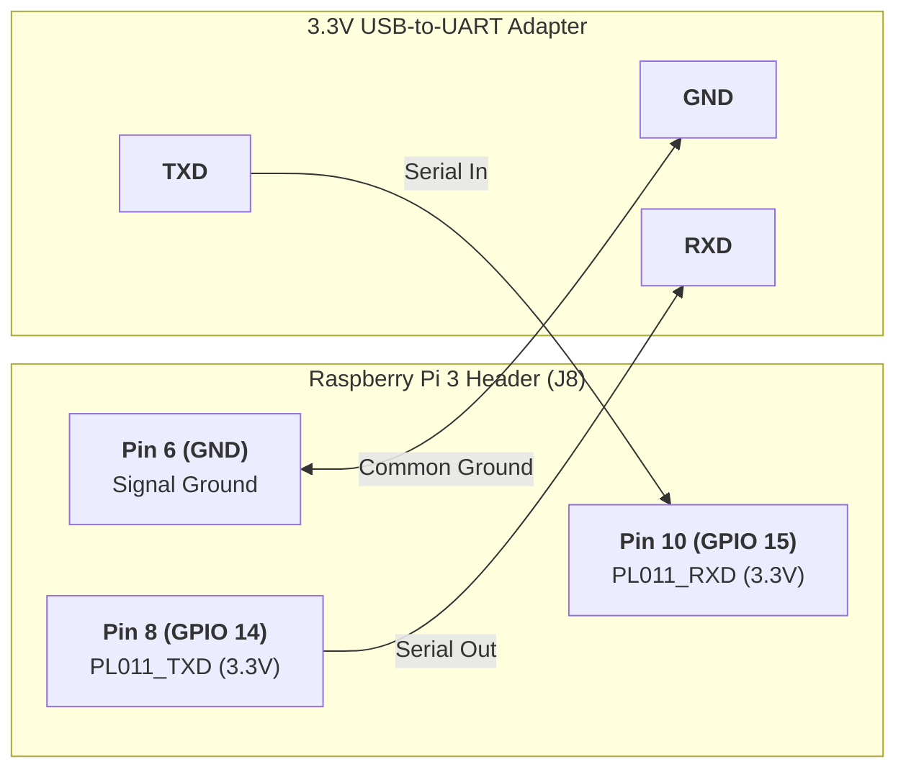

# Hardware Platform, Power & Physical Interfaces

The appliance targets the **Raspberry Pi 3 Model B** based on the Broadcom BCM2837 SoC. In digital signage and public kiosk environments, field deployments frequently face poor-quality 5V USB power supplies, unventilated enclosures, long HDMI cables, and harsh electrical conditions. This document outlines the hardware mitigations, clock tuning, radio stripping, and physical UART configuration implemented to guarantee non-stop reliability.

---

## 1. Hardware Specifications & Constraints

| Parameter | Specification | Impact on Kiosk Operation |
| :--- | :--- | :--- |
| **SoC** | Broadcom BCM2837 (28nm process) | Quad-core ARM Cortex-A53 @ 1.2 GHz default |
| **Instruction Set** | ARMv8-A (`aarch64`) | Enables 64-bit kernel and modern compiler optimizations |
| **Memory** | 1 GB LPDDR2 SDRAM (900 MHz) | Split between CPU and GPU (`gpu_mem=128`) |
| **GPU** | Broadcom VideoCore IV (V3D 2.1) | Direct hardware decoding via V4L2 M2M and VC4 Gallium DRM |
| **Power Input** | Micro-USB (5V DC, rated 2.5A) | Susceptible to brownouts if cable resistance exceeds 0.2 $\Omega$ |
| **Networking** | BCM43438 (2.4 GHz 802.11n + BT 4.1) | High RF noise and parasitic power draw if left unmanaged |
| **Primary Serial** | ARM PL011 PrimeCell UART | Dedicated hardware UART on GPIO 14/15 |

---

## 2. Power & Thermal Mitigations

### 2.1 Brownout Voltage Sags & Undervoltage Protection
The Raspberry Pi 3 Model B contains an onboard APX803 power monitor IC that flags low voltage whenever the 5V rail drops below **$4.63\text{V} \pm 5\%$**. 
When standard installations run high-bitrate 1080p decoding at stock clocks (1200 MHz), sudden CPU/GPU current spikes create voltage drops across low-grade power bricks and thin USB cables. This triggers firmware clock throttling, core resets, and catastrophic Ext4 filesystem corruption.

In [`alpine-kiosk/configs/config.txt`](file:///home/sarp/rpi3-videokiosk/alpine-kiosk/configs/config.txt#L22-L30), the power envelope is tightly bounded:
```ini
# Hardware Clock & Power Stability
initial_turbo=20
arm_freq=1000
arm_freq_min=600
core_freq=400
sdram_freq=450
over_voltage=0
```

### 2.2 The Initial Turbo Burst Strategy (`initial_turbo=20`)
- **Cold Boot Acceleration:** When power is applied, the GPU bootloader enforces maximum burst frequency (1200 MHz) for the first **20 seconds** (`initial_turbo=20`). This accelerates kernel decompression, initramfs execution, and video caching into RAM.
- **Sustained 1000 MHz Operational Ceiling:** Once the 20-second window elapses, the CPU clock ceiling locks at **1000 MHz** (`arm_freq=1000`).
- **Thermal and Power Impact:**
  - Peak transient current drops by approximately **28%** compared to stock 1.2 GHz operation.
  - Core operating temperature settles between **$48^\circ\text{C}$ and $54^\circ\text{C}$** inside sealed, fanless acrylic or metal enclosures without thermal throttling.
  - Eliminates voltage sag brownouts on non-official or aging 5V/2A adapters.

---

## 3. RF Radio Disablement & Power Savings

In standalone digital signage installations, wireless radios introduce unnecessary parasitic power consumption, thermal load, and RF interference with nearby industrial or audiovisual electronics.

The onboard Cypress BCM43438 Wi-Fi and Bluetooth chip is disabled at the firmware Device Tree level in [`alpine-kiosk/configs/config.txt`](file:///home/sarp/rpi3-videokiosk/alpine-kiosk/configs/config.txt#L34-L39):
```ini
# Disable Unused Radios (Power saving & zero RF interference)
dtoverlay=disable-wifi
dtoverlay=disable-bt
dtparam=audio=off
```

### Engineering Rationale
1. **Clock Generator Shutdown:** The firmware disables the SDIO interface clock driving the Wi-Fi transceiver and powers down the internal Bluetooth baseband oscillator.
2. **Current Reduction:** Eliminates **~80 mA to 120 mA** of idle radio current, significantly widening the power supply safety margin.
3. **Firmware Decoupling:** Releasing the Bluetooth UART interface frees the high-precision ARM PL011 UART controller exclusively for the hardware serial console.

---

## 4. Dedicated PL011 Hardware UART Backend

In standard Raspberry Pi OS, the mini-UART (`/dev/ttyS0`) is used for the console because the superior PL011 UART (`/dev/ttyAMA0`) is routed to the onboard Bluetooth modem. The mini-UART has a tiny 8-byte FIFO and its baud rate fluctuates with GPU VPU core clock changes.

Because Bluetooth is disabled (`dtoverlay=disable-bt`), the full **ARM PrimeCell PL011 UART** is restored to the primary GPIO pins with a dedicated 32-byte FIFO, fractional baud rate generation, and independent clocking.

```ini
# In alpine-kiosk/configs/config.txt
enable_uart=1
```

### 4.1 Physical Pinout Reference (40-Pin GPIO Header)



| Header Pin | Function | BCM GPIO | Direction | UART Adapter Connection |
| :--- | :--- | :--- | :--- | :--- |
| **Pin 6** | Ground | Ground | — | **GND** |
| **Pin 8** | `PL011_TXD` | GPIO 14 | Out (3.3V Logic) | **RXD** |
| **Pin 10** | `PL011_RXD` | GPIO 15 | In (3.3V Logic) | **TXD** |

> [!WARNING]
> The Raspberry Pi GPIO lines operate strictly at **3.3V TTL logic levels**. Never connect an RS-232 12V DB9 cable or a 5V FTDI adapter directly to GPIO 14/15 without level shifting.

---

## 5. Instant Headless Autologin & HDMI Isolation

### 5.1 Console Decoupling via inittab
The serial backend is completely decoupled from the video display output. In [`alpine-kiosk/overlay/etc/inittab`](file:///home/sarp/rpi3-videokiosk/alpine-kiosk/overlay/etc/inittab#L6-L12):
```ini
# Physical Serial UART Console on Raspberry Pi 3 (GPIO 14/15, Pins 8/10/6)
# Instant unprompted root shell at 115200 baud with xterm-256color as login shell
ttyAMA0::respawn:/sbin/getty -L 115200 ttyAMA0 xterm-256color -n -l /sbin/autologin

# Virtual consoles (Disabled on HDMI for pure digital signage kiosk)
# tty1 is intentionally not spawned to prevent any login prompt or shell on HDMI
```

### 5.2 Autologin Wrapper
The autologin launcher [`alpine-kiosk/overlay/sbin/autologin`](file:///home/sarp/rpi3-videokiosk/alpine-kiosk/overlay/sbin/autologin) executes:
```sh
#!/bin/sh
exec /bin/sh -l
```
This bypasses password prompts and invokes BusyBox ash as a full login shell, sourcing [`/etc/profile`](file:///home/sarp/rpi3-videokiosk/alpine-kiosk/overlay/etc/profile.d/kiosk.sh) and exporting:
- `TERM=xterm-256color`
- Full command PATH to `/usr/local/bin:/usr/bin:/bin:/sbin`

### 5.3 Complete HDMI Silence
In [`alpine-kiosk/configs/cmdline.txt`](file:///home/sarp/rpi3-videokiosk/alpine-kiosk/configs/cmdline.txt):
```
console=ttyAMA0,115200 quiet splash=no vt.global_cursor_default=0 logo.nologo consoleblank=0 quiet_opt=yes
```
- `console=ttyAMA0,115200`: Kernel `printk` messages are routed exclusively to the serial pins.
- `logo.nologo`: Suppresses the four Linux Tux boot logos.
- `vt.global_cursor_default=0`: Deactivates blinking text cursors on all virtual consoles.
- `tty1` is never spawned in `inittab`, guaranteeing that no terminal text or shell prompt ever appears on the HDMI screen.
