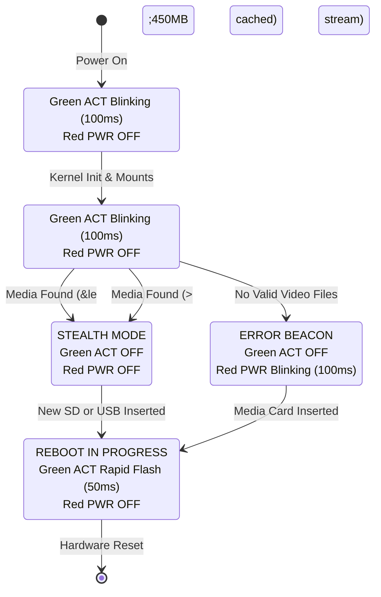

# Hardware LED Operational State Machine & Linux Kernel Quirks

On a commercial digital signage kiosk deployed in public spaces, museums, or retail windows, physical indicators serve two vital functions:
1. **Operator Diagnostics:** Allowing on-site staff or technicians to verify the kiosk state at a glance without needing to hook up a console cable or inspect the display.
2. **Stealth Operation:** In darkened exhibition halls or high-end retail displays, blinking board LEDs are visually disruptive and give away the embedded hardware behind the screen.

The Raspberry Pi 3 Video Kiosk implements an event-driven hardware LED state machine controlling the onboard Green Activity (`ACT`) and Red Power (`PWR`) LEDs via the Linux kernel `leds-gpio` sysfs subsystem.

---

## 1. Hardware Architecture & LED Mapping

The Raspberry Pi 3 Model B routes its status LEDs differently from earlier models:

| LED | Color | Hardware Path / Sysfs Node | Default Firmware / Kernel Role | Kiosk Assignment |
| :--- | :--- | :--- | :--- | :--- |
| **ACT** | Green | `/sys/class/leds/ACT` (or `led0`) | `mmc0` (SD card activity) | Boot progress, RAM caching, and reboot flash |
| **PWR** | Red | `/sys/class/leds/PWR` (or `led1`) | `input` (Undervoltage APX803 monitor) | Missing media error beacon |

> **Note on BCM2837 LED Routing:**  
> On the Raspberry Pi 3 Model B, the Red PWR LED is controlled via an I2C GPIO expander rather than direct BCM2837 SoC GPIO pins. The Linux kernel exposes it as `/sys/class/leds/PWR`. By default, the firmware links this LED to the onboard APX803 undervoltage comparator (it turns off when the 5V rail dips below 4.63V). Overriding its sysfs trigger gives full user-space control.

---

## 2. Operational State Matrix



| Operational Phase | Green (ACT) LED | Red (PWR) LED | Trigger / Timing | Intended Meaning |
| :--- | :--- | :--- | :--- | :--- |
| **Early Initramfs Boot** | **Blinking (100ms)** | **OFF** | `timer`, `delay_on=100`, `delay_off=100` | Kernel up; unpacking Alpine rootfs to RAM |
| **Media Scan & RAM Copy** | **Blinking (100ms)** | **OFF** | `timer`, `delay_on=100`, `delay_off=100` | Reading SD card FAT32; caching videos into `/run/kiosk-videos` tmpfs |
| **Active Playback** | **OFF** | **OFF** | `trigger=none`, `brightness=0` | **Stealth Mode:** Pure darkness for venue immersion |
| **No Media Found** | **OFF** | **Blinking (100ms)** | `timer`, `delay_on=100`, `delay_off=100` | **Error Beacon:** Storage has no valid video files |
| **Media Inserted / Reboot**| **Rapid Flash (50ms)**| **OFF** | `timer`, `delay_on=50`, `delay_off=50` | New SD card / USB detected; clean reboot in progress |

---

## 3. The Linux `ledtrig-timer` Sysfs Quirk

During development, a subtle kernel behavior caused the Red PWR LED to fail to blink when entering the "No Media Found" state:

### Root Cause Analysis
1. During the early boot phase, the Red LED was explicitly turned off to ensure a dark display:
   ```bash
   echo 0 > /sys/class/leds/PWR/brightness
   ```
2. When the media discovery script failed to locate any `.mp4` or `.mkv` files, it attempted to activate the timer trigger:
   ```bash
   echo timer > /sys/class/leds/PWR/trigger
   echo 100 > /sys/class/leds/PWR/delay_on
   echo 100 > /sys/class/leds/PWR/delay_off
   ```
3. **The Kernel Gotcha:** In the Linux `ledtrig-timer` driver (`drivers/leds/trigger/ledtrig-timer.c`), the timer trigger toggles the LED between `0` and the current `led_cdev->brightness` value. Because `brightness` was previously set to `0`, the timer driver oscillated between `0` and `0`. The LED remained stubbornly off!
4. Additionally, if an OpenRC local script (e.g. `/etc/local.d/00-kiosk-leds.start`) executed asynchronously in the background, it would overwrite the player's LED settings.

### The Robust Implementation
In [`kiosk-player.sh`](file:///home/sarp/rpi3-videokiosk/alpine-kiosk/overlay/usr/bin/kiosk-player.sh#L53-L67) and the `led` command utility, setting a timer trigger explicitly enforces:
```bash
set_no_media_leds() {
    # 1. Force Green ACT completely off
    echo none > /sys/class/leds/ACT/trigger 2>/dev/null || true
    echo 0 > /sys/class/leds/ACT/brightness 2>/dev/null || true

    # 2. Reset Red PWR trigger to none, restore brightness to 1
    echo none > /sys/class/leds/PWR/trigger 2>/dev/null || true
    echo 1 > /sys/class/leds/PWR/brightness 2>/dev/null || true

    # 3. Apply timer trigger and set timing
    echo timer > /sys/class/leds/PWR/trigger 2>/dev/null || true
    echo 100 > /sys/class/leds/PWR/delay_on 2>/dev/null || true
    echo 100 > /sys/class/leds/PWR/delay_off 2>/dev/null || true
}
```
Furthermore, the no-media polling loop periodically re-asserts these parameters every 2 seconds to prevent external sysfs resets or driver resets.

---

## 4. Initramfs Early Boot Signaling

The LED state machine starts long before userspace or OpenRC services run. Inside [`alpine-kiosk/build.sh`](file:///home/sarp/rpi3-videokiosk/alpine-kiosk/build.sh), the Alpine Linux `initramfs-rpi` init script is directly patched:

```sh
# Patch initramfs to signal boot progress via ACT LED
for pwr in /sys/class/leds/*pwr* /sys/class/leds/PWR /sys/class/leds/led1; do
    [ -d "$pwr" ] && echo none > "$pwr/trigger" 2>/dev/null && echo 0 > "$pwr/brightness" 2>/dev/null
done
for act in /sys/class/leds/*act* /sys/class/leds/ACT /sys/class/leds/led0; do
    if [ -d "$act" ]; then
        echo none > "$act/trigger" 2>/dev/null
        echo 1 > "$act/brightness" 2>/dev/null
        echo timer > "$act/trigger" 2>/dev/null
        echo 100 > "$act/delay_on" 2>/dev/null
        echo 100 > "$act/delay_off" 2>/dev/null
    fi
done
```

As soon as the Linux kernel loads the initramfs (around second 2 of power-on), the Green LED begins pulsing at 5 Hz, giving the operator instant visual confirmation that the kernel is healthy and uncompressing the system into RAM.

---

## 5. Command-Line Utility: `led`

To inspect and manipulate the LEDs over the PL011 UART serial console or during installation testing, a unified CLI utility is installed at `/usr/bin/led`:

### Usage Syntax
```bash
led <act|pwr|red|green> <on|off|blink [ms]>
led status
led stealth
led reboot
```

### Examples
- **Check current state:**
  ```bash
  # led status
  ACT (green): trigger=[none], brightness=0
  PWR (red):   trigger=[timer], delay_on=100, delay_off=100
  ```
- **Force stealth mode:**
  ```bash
  # led stealth
  [LED] Stealth mode enabled (all LEDs OFF)
  ```
- **Simulate missing media error:**
  ```bash
  # led red blink 100
  [LED] PWR (red) blinking (100ms)
  ```
- **Trigger reboot beacon:**
  ```bash
  # led reboot
  [LED] Reboot state (rapid green flash)
  ```
