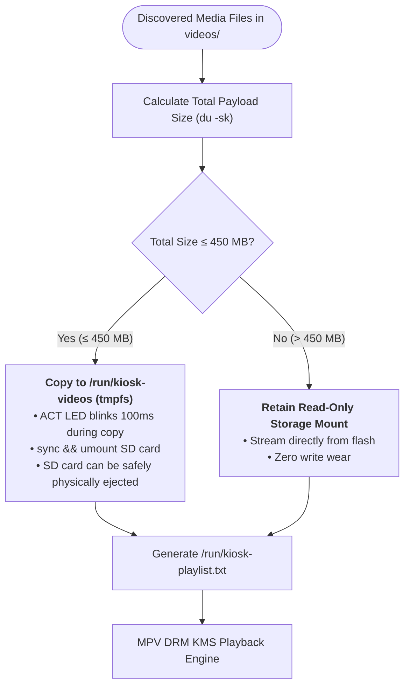

# Media Pipeline & Storage Management

The media subsystem in [`/usr/bin/kiosk-player.sh`](file:///home/sarp/rpi3-videokiosk/alpine-kiosk/overlay/usr/bin/kiosk-player.sh) provides autonomous video discovery, smart RAM caching, live physical SD card hot-ejection, gapless multi-video playlist looping, and dynamic screen rotation.

---

## 1. Smart In-RAM VFS Caching

The appliance implements an automated memory-budgeting algorithm to determine whether media files should be cached directly into RAM or streamed from physical storage:



### 1.1 Memory Allocation Budget (1 GB Total SDRAM)

| Memory Consumer | Allocated Boundary | Description |
| :--- | :--- | :--- |
| **GPU Shared Memory** | `128 MB` | Reserved in [`config.txt`](file:///home/sarp/rpi3-videokiosk/alpine-kiosk/configs/config.txt#L11) (`gpu_mem=128`) for hardware video plane and Mesa VC4 |
| **In-RAM Video Cache** | Up to `450 MB` | Mounted in volatile `tmpfs` at [`/run/kiosk-videos`](file:///home/sarp/rpi3-videokiosk/alpine-kiosk/overlay/usr/bin/kiosk-player.sh#L12) (`MAX_RAM_CACHE_KB=460800`) |
| **Alpine OS & Kernel** | `~38 MB` | Linux kernel, slab cache, devtmpfs, OpenRC services |
| **MPV & Decoding Buffer** | `~120 MB` | Framebuffer queue, lavc thread allocators, prefetch caches |
| **Safety Headroom** | `~288 MB` | Prevents Linux Out-Of-Memory (`oom-killer`) invocations |

---

## 2. Safe Live SD Card Hot-Ejection

A major reliability milestone in v0.4 is **safe live SD card hot-ejection**. 

When the video payload fits within the 450 MB limit, [`kiosk-player.sh`](file:///home/sarp/rpi3-videokiosk/alpine-kiosk/overlay/usr/bin/kiosk-player.sh#L284-L290) executes:
```sh
# Unmount SD card to allow physical hot-ejection
if [ "$SRC_DIR" = "/media/mmcblk0p1/videos" ]; then
    echo "[kiosk-player] In-RAM cache complete. Unmounting SD card (safe for physical hot-eject)..." >&2
    sync
    umount /media/mmcblk0p1 2>/dev/null || true
fi
```

### Operational Benefits in Commercial Deployments
1. **Theft Prevention:** In public installations, gallery staff can flash the SD card, boot the kiosk, let it copy to RAM, and physically remove the SD card from the unit. The kiosk loops indefinitely from RAM without any accessible media cards.
2. **Batch Programming:** A single SD card can be used to boot and load multiple display kiosks in sequence.
3. **Hardware Shock Tolerance:** Physical impacts or vibrations that briefly disconnect SD card slot pins will never crash playback or corrupt system files.

---

## 3. Fallback Streaming Mode (> 450 MB)

When the media payload exceeds the 450 MB threshold, attempting to copy into `tmpfs` would exhaust system RAM and trigger Linux kernel OOM panics. 

The engine detects this condition automatically:
```sh
TOTAL_KB=$(du -sk "$SRC_DIR" 2>/dev/null | awk '{print $1}')
if [ "$TOTAL_KB" -le "$MAX_RAM_CACHE_KB" ]; then
    # Copy to tmpfs
    ...
else
    echo "[kiosk-player] Video payload (${TOTAL_MB} MB) exceeds RAM limit (450 MB). Streaming from disk." >&2
    find "$SRC_DIR" -maxdepth 1 -type f \( -iname "*.mp4" -o -iname "*.mkv" ... \) | sort > "$PLAYLIST_FILE"
fi
```
In fallback mode:
- Storage remains mounted strictly read-only (`ro,noatime`).
- MPV streams directly from the SD card or USB flash drive.
- Power cuts remain harmless because the block device has zero write locks.

---

## 4. Gapless Multi-Video Playlist Loop Engine

Multiple videos are discovered, sorted, and looped without black gaps or stuttering between track transitions.

### 4.1 Supported Media Container Formats
The media scanner parses the following file extensions (case-insensitive):
- `.mp4` (MPEG-4 Part 14 / H.264 AVC) — *Recommended*
- `.mkv` (Matroska)
- `.avi` (Audio Video Interleaved)
- `.mov` (QuickTime File Format)
- `.webm` (VP8 / VP9)
- `.ts` (MPEG Transport Stream)

### 4.2 Space-Safe Filename Handling
Files with spaces, punctuation, and non-ASCII names (e.g., `01 - Intro & Brand Presentation.mp4`) are handled safely without word-splitting bugs using null-safe `find -exec` syntax:
```sh
find "$SRC_DIR" -maxdepth 1 -type f \( -iname "*.mp4" -o -iname "*.mkv" -o -iname "*.avi" -o -iname "*.mov" -o -iname "*.webm" -o -iname "*.ts" \) -exec cp -p {} "$RAM_VIDEOS_DIR/" \;
find "$RAM_VIDEOS_DIR" -maxdepth 1 -type f \( ... \) | sort > "$PLAYLIST_FILE"
```

### 4.3 MPV Seamless Pipeline Flags
In [`kiosk-player.sh`](file:///home/sarp/rpi3-videokiosk/alpine-kiosk/overlay/usr/bin/kiosk-player.sh#L331-L341):
```sh
/usr/bin/mpv \
    --no-config \
    --vo=gpu \
    --gpu-context=drm \
    --video-rotate="$ROTATION" \
    --loop-playlist=inf \
    --no-audio \
    --cursor-autohide=always \
    --prefetch-playlist=yes \
    --playlist="$PLAYLIST_FILE"
```

- `--prefetch-playlist=yes`: MPV probes and pre-buffers the first 100–500ms of the next video while the current video is playing. This eliminates HDMI modeswitch delays and black-frame dropouts between clips.
- `--loop-playlist=inf`: Plays all items in the playlist sequentially and seamlessly restarts from the first video indefinitely.
- `--no-audio`: Disables audio pipeline initialization, avoiding ALSA sound card locks and timing drift.

---

## 5. Dynamic Display Orientation Engine

Display rotation is configured via `orientation.txt` on the root of the SD card or USB drive.

### 5.1 Orientation Syntax & Normalization

The parser in [`read_orientation`](file:///home/sarp/rpi3-videokiosk/alpine-kiosk/overlay/usr/bin/kiosk-player.sh#L21-L53) ignores comments (`#`), strips whitespace, and converts strings to lowercase:

| Raw Value in `orientation.txt` | Normalized Degree | Screen Configuration |
| :--- | :--- | :--- |
| `0`, `landscape`, `normal` | **`0`** | Standard landscape orientation |
| `90`, `portrait`, `right` | **`90`** | 90° clockwise rotation for vertical totems |
| `180`, `inverted`, `flip`, `upside-down` | **`180`** | Inverted 180° for ceiling or inverted mounts |
| `270`, `portrait-inverted`, `left` | **`270`** | 270° (90° counter-clockwise) for reversed vertical totems |

### 5.2 Search Order
The orientation engine searches for configuration in the following priority:
1. Volatile memory cache: `/run/kiosk-orientation`
2. SD boot partition: `/media/mmcblk0p1/orientation.txt`
3. USB drive root: `/media/*/orientation.txt`
4. Root fallback: `/videos/orientation.txt`, `/orientation.txt`, `/etc/videokiosk/orientation.txt`

The parsed orientation is cached in `/run/kiosk-orientation` and passed directly to MPV via `--video-rotate="$ROTATION"`. Rotation is performed on the VideoCore IV GPU plane with zero CPU penalty.
